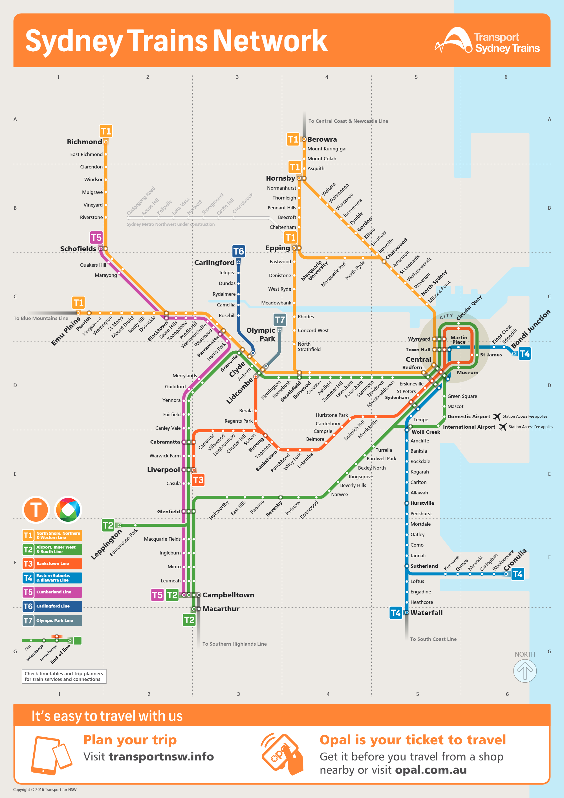
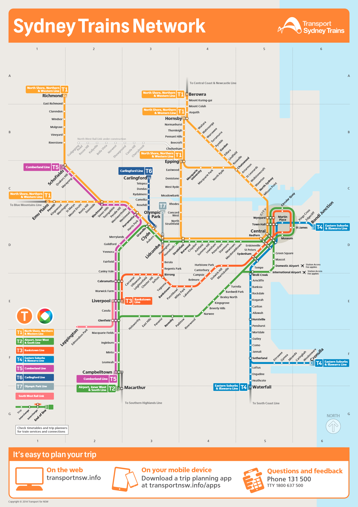
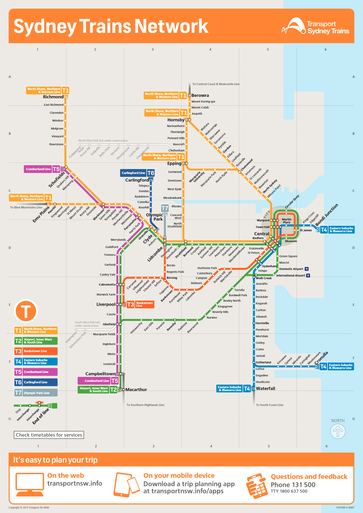

# Home

Archived official .PDF maps.

## Sydney Trains

| Image | Code | Year | .PDF |
| ------ | ------- | ---- | ---- |
|  | `1610TMS-E-MWT-A4P` | 2016 | [.PDF](sydney-trains/1610TMS-E-MWT-A4P.pdf) |
|  | `1411TMS-E-MWT-A4` | 2014 | [.PDF](sydney-trains/1411TMS-E-MWT-A4.pdf) |
|  | `1310TMS-E-MWT` | 2013 | [.PDF](sydney-trains/1310TMS-E-MWT.pdf) |

- [2013](sydney-trains/1310TMS-E-MWT.pdf)
- [2014](sydney-trains/1411TMS-E-MWT-A4.pdf)
- [2016](sydney-trains/1610TMS-E-MWT-A4P.pdf)
- [2017](sydney-trains/1709TMS-E-MWT-A4P.pdf)
- 2018 ([1st](sydney-trains/1807TMS-E-MWT-A4P.pdf)/[2nd](sydney-trains/1812TMS-E-MWT-A4P.pdf))
- [2019](sydney-trains/1909TMS-E-MWT-A4P-WCAG.pdf)
- [2021](sydney-trains/2105TMS-P-COR-A3P.pdf)
- [2023](sydney-trains/545x760_Onboard_SRM_2023.pdf)
- [2024](sydney-trains/APXP_SRM_20240701.pdf) ([Onboard](sydney-trains/360x500_Onboard_SRM_20240701.pdf)/[SRM](sydney-trains/1150x1750_SRM_20240701.pdf))

## Intercity Trains

- [2013](intercity-trains/1310TMI-E-MWT.pdf)
- [2014](intercity-trains/1411TMI-E-MWT-A4.pdf)
- [2017](intercity-trains/1708TMI-E-MWT-A4P.pdf)
- [2018](intercity-trains/1807TMI-E-MWT-A4P.pdf)
- 2019 ([1st](intercity-trains/1902TMI-E-MWT-A4P.pdf)/[2nd](intercity-trains/1907TMI-E-MWT-A4P-WCAG.pdf))
