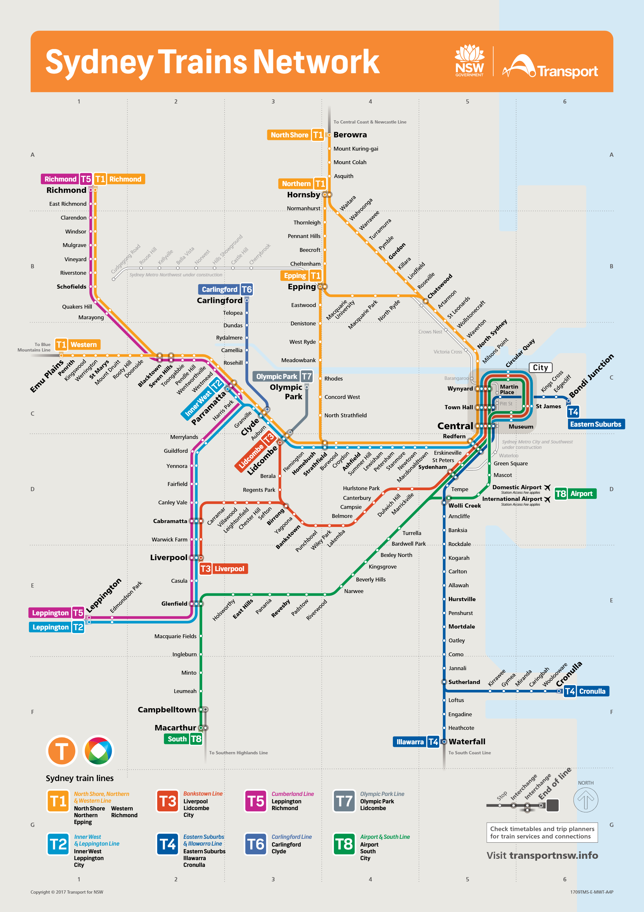

# Home

Archived official .PDF maps.

## Sydney Trains

| Image | Code | Year | .PDF |
| ------ | ------- | ---- | ---- |
|  | `1150x1750_SRM_20240701` | 2024 | [.PDF](sydney-trains/1150x1750_SRM_20240701.pdf) |
|  | `360x500_Onboard_SRM_20240701` | 2024 | [.PDF](sydney-trains/360x500_Onboard_SRM_20240701.pdf) |
|  | `APXP_SRM_20240701` | 2024 | [.PDF](sydney-trains/APXP_SRM_20240701.pdf) |
|  | `545x760_Onboard_SRM_2023` | 2023 | [.PDF](sydney-trains/545x760_Onboard_SRM_2023.pdf) |
|  | `2105TMS-P-COR-A3P` | 2021 | [.PDF](sydney-trains/2105TMS-P-COR-A3P.pdf) |
|  | `1909TMS-E-MWT-A4P-WCAG` | 2019 | [.PDF](sydney-trains/1909TMS-E-MWT-A4P-WCAG.pdf) |
|  | `1812TMS-E-MWT-A4P` | 2018 | [.PDF](sydney-trains/1812TMS-E-MWT-A4P.pdf) |
|  | `1807TMS-E-MWT-A4P` | 2018 | [.PDF](sydney-trains/1807TMS-E-MWT-A4P.pdf) |
|  | `1709TMS-E-MWT-A4P` | 2017 | [.PDF](sydney-trains/1709TMS-E-MWT-A4P.pdf) |
|  | `1610TMS-E-MWT-A4P` | 2016 | [.PDF](sydney-trains/1610TMS-E-MWT-A4P.pdf) |
|  | `1411TMS-E-MWT-A4` | 2014 | [.PDF](sydney-trains/1411TMS-E-MWT-A4.pdf) |
|  | `1310TMS-E-MWT` | 2013 | [.PDF](sydney-trains/1310TMS-E-MWT.pdf) |

## Intercity Trains

| Image | Code | Year | .PDF |
| ------ | ------- | ---- | ---- |
|  | `1907TMI-E-MWT-A4P-WCAG` | 2019 | [.PDF](intercity-trains/1907TMI-E-MWT-A4P-WCAG.pdf) |
|  | `1902TMI-E-MWT-A4P` | 2019 | [.PDF](intercity-trains/1902TMI-E-MWT-A4P.pdf) |
|  | `1807TMI-E-MWT-A4P` | 2018 | [.PDF](intercity-trains/1807TMI-E-MWT-A4P.pdf) |
|  | `1708TMI-E-MWT-A4P` | 2017 | [.PDF](intercity-trains/1708TMI-E-MWT-A4P.pdf) |
|  | `1411TMI-E-MWT-A4` | 2014 | [.PDF](intercity-trains/1411TMI-E-MWT-A4.pdf) |
|  | `1310TMI-E-MWT` | 2013 | [.PDF](intercity-trains/1310TMI-E-MWT.pdf) |
